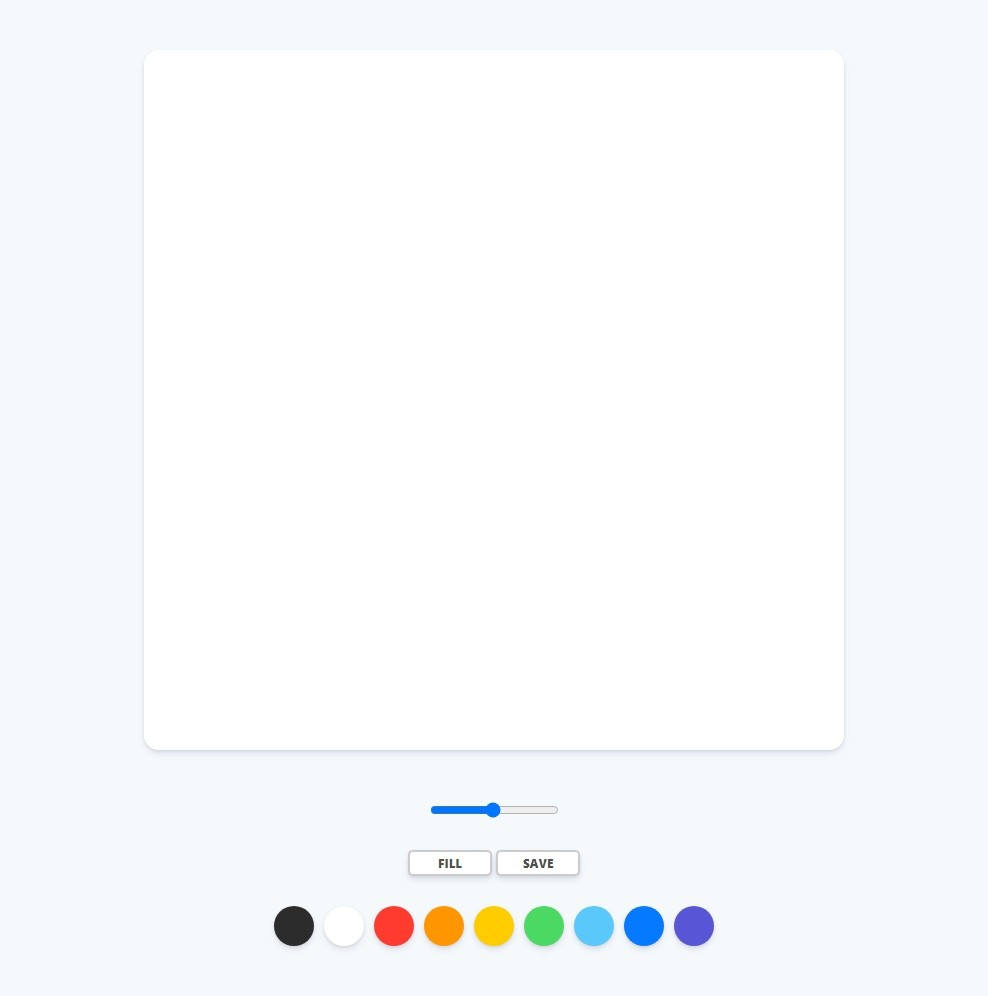
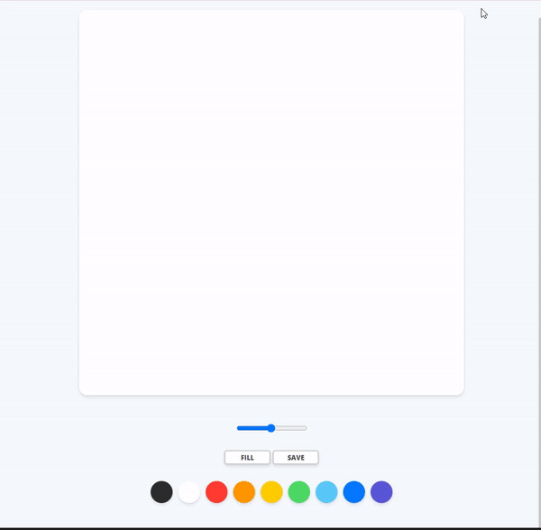
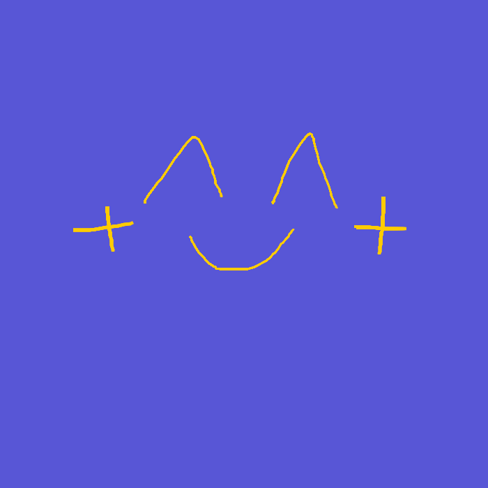

# Painting Board

## 간단한 그림판 만들기

**HTML, CSS, Vanila JS**

**21.06.30 ~ 21.07.03**

https://00eun.github.io/paintjs/

---

### 주요 구현 기능

- 그리기 기능
- 선 굵기 조절하기
- 원하는 색으로 색상 변경하기
- 선으로 그리기 채우기 선택하기
- 다 그린 그림 저장하기

#### 메인화면 RESULT

#### 기능구현 예시화면 RESULT (~20초)

#### 저장 이미지 RESULT (~20초)

 

---

프로젝트 정보 : [노마드 코더](https://nomadcoders.co/)
